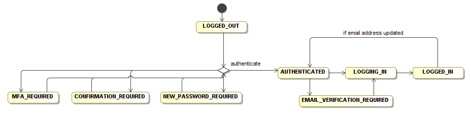

# Design

## State machine

This the the local state machine model:

## Summary of use cases

The cognito js library helpfully lists all of the 24 use cases [on their github](https://github.com/aws/amazon-cognito-identity-js/).

This is the current status of each use case in react-cognito:

### Completed

- UC1 Registering a user with the application
- UC2 Confirming a registered, unauthenticated user
- UC3 Resending a confirmation code via SMS
- UC4 Authenticating and establishing a session
- UC5 Retrieving user attributes for an authenticated user
- UC6 Verify email address for an authenticated user
- UC8 Update a user attribute for an authenticated user
- UC11 Change the current password for an authenticated user
- UC12 Starting and completing a forgotten password flow for an unauthenticated user
- UC14 Sign out
- UC16 Retrieve the user from local storage
- UC17 Log into an identity pool with a cognito user
- UC23 Set a new password on inital login for an admin created user

### Planned for version 1, but not yet implemented

### Not planned for version 1

#### Trivial anyway

- UC7 Delete a user attribute for an authenticated user
- UC9 Enable MFA for a user on a pool that has optional MFA
- UC10 Disable MFA for a user on a pool that has optional MFA
- UC13 Deleting an authenticated user
- UC15 Global sign out (invalidates all issued tokens)

#### MFA Support

- UC24 Retrieve the MFA options for the user in case MFA is optional

Plus any MFA implementation

#### Device support

- UC18 List all remembered devices for an authenticated user
- UC19 List all information about the current device
- UC20 Remember a device
- UC21 Do not remember a device
- UC22 Forget the current device

## Issues

- Review how visual transitions should be integrated into e.g. logging in
- Consider offline / liefi use

# The Redux Model

## State Machine

Users start in state `LOGGED_OUT`.

When they enter a username and password we call `authenticateUser` on the CognitoUser
object and transition to a new state if the credentials worked:

- `MFA_REQUIRED`
- `NEW_PASSWORD_REQUIRED`
- `CONFIRMATION_REQUIRED`
- `AUTHENTICATED`

If in `AUTHENTICATED` then a transition happens using a store subscriber. There are
three options:

1. no-verification - the state transitions directly to LOGGING_IN
2. fetch-attributes - attributes are fetched then transitions to LOGGING_IN
3. verify-email - the attributes are fetched and email_verified checked, then 
   transitions to LOGGING_IN or EMAIL_VERIFICATION_REQUIRED.

From LOGGING_IN default behaviour is to get a session (using `CognitoUser.getSession`) from which we can get an auth token, then establishing a session with a Federated Identity Pool.

If all of that succeeds we transition to 'LOGGED_IN'.

